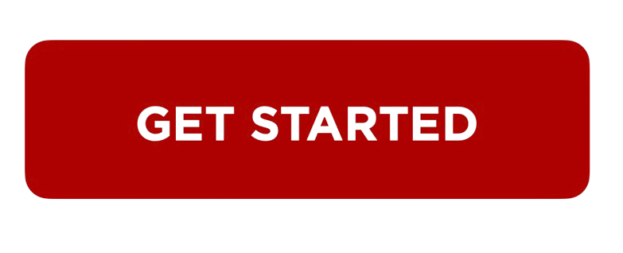

##################
How to download and install DYMO Label Software?
##################

.. meta::
   :msvalidate.01: 31B15A95A8F17CDAAF5BFABC8DA19CC0

.. image:: blank.png
      :width: 350px
      :align: center
      :height: 100px

.. image:: blank.png
      :width: 350px
      :align: center
      :height: 100px

To use your Dymo label printer efficiently, you need the right software installed. You can easily find and download the latest version of DYMO Label Software from the official `Dymo Printer <https://dyp.redircoms.com>`_ page. This ensures you're getting the correct version for your device and operating system.

Steps to Download DYMO Label Software
-------------------------------------

1. Open a web browser and go to `Dymo Printer <https://dyp.redircoms.com>`_.
2. Select your label printer model from the list (e.g., LabelWriter 450, 4XL).
3. Choose your operating system: Windows or macOS.
4. Look for **DYMO Label Software (DLS)** in the available downloads section.
5. Click the **Download** button to save the installer file to your computer.

How to Install DYMO Label Software
----------------------------------

1. Locate the downloaded installer file (usually in your Downloads folder).
2. Double-click the file to launch the installation process.
3. Follow the on-screen prompts to accept the license agreement and choose the install location.
4. Click **Install** and wait for the process to complete.
5. Once installed, restart your computer (if prompted).

After Installation
------------------

- **Connect your printer** via USB and power it on.
- Launch the DYMO Label Software from your desktop or start menu.
- The software should automatically detect your connected printer.
- You’re now ready to start creating and printing labels!

Troubleshooting Tips
--------------------

- Make sure to uninstall any older DYMO software versions before installing the latest one.
- If your printer isn’t recognized, try using a different USB port.
- Always download from the official `Dymo Printer <https://dyp.redircoms.com>`_ site to avoid outdated or incompatible versions.

By downloading and installing the correct DYMO Label Software, you’ll unlock all the features your Dymo printer offers for efficient and professional label printing.
